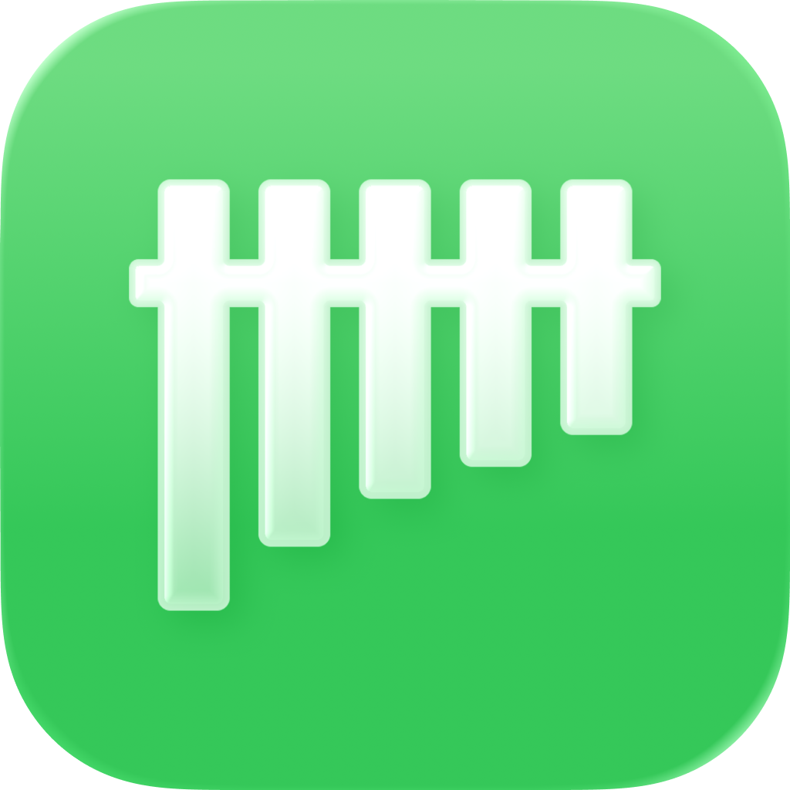
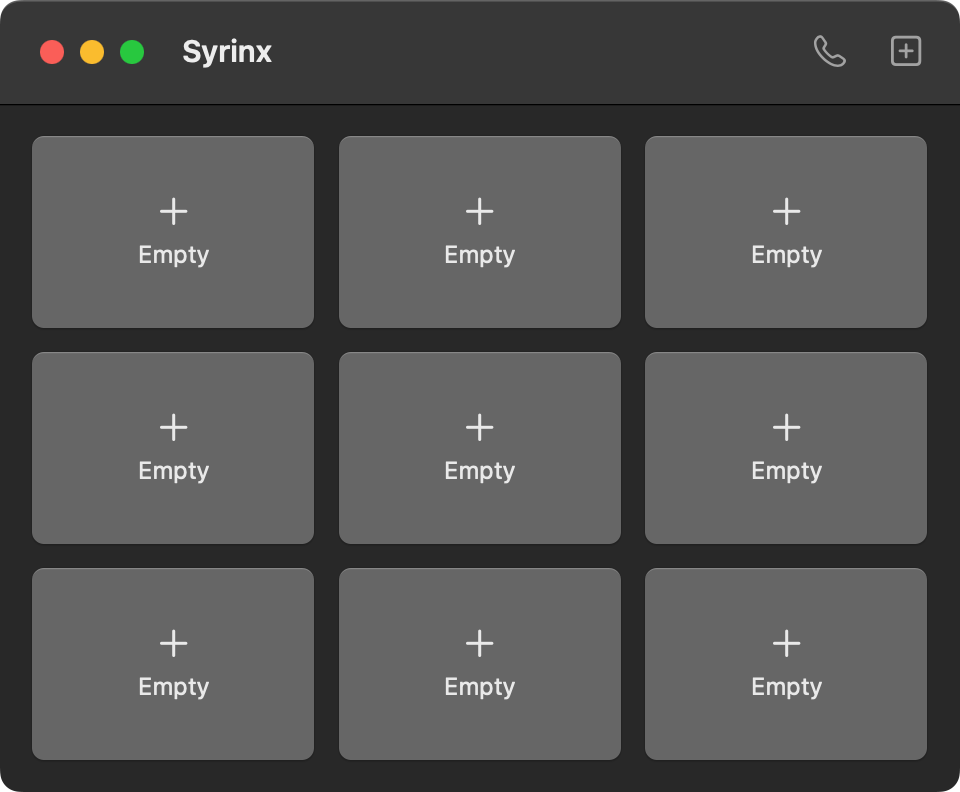

<h1>
<p align="center">
  
  <br>Syrinx
</p>
</h1>
<p align="center">
  A native macOS soundboard that routes into your voice calls.
</p>
<p align="center">
  
  
  
</p>

<p align="center">
  
</p>

<br />

## About

Drop in clips, click a pad to play them, and route them into Discord, Zoom, or any call app alongside your voice.

- **Native** - Built with SwiftUI and AVFoundation. No Electron.
- **Own driver** - Ships a from-scratch CoreAudio virtual mic driver, not a BlackHole wrapper.
- **Local by default** - Never touches your mic until Call Mode is on.
- **Nothing recorded** - Call Mode forwards audio live, never to disk.

## Features

- Drag-and-drop or file-picker clips, MP3 and WAV
- Click to play; pads can overlap freely
- Per-pad volume, rename, and delete
- Call Mode: mixes mic + pad audio into a virtual "Syrinx Microphone" input
- Pick a specific mic for Call Mode, or follow system default

## Install

### Homebrew

```
brew install --cask uhojin/tap/syrinx
```

Or add the tap first:

```
brew tap uhojin/tap
brew install --cask syrinx
```

### Manual

Download the latest `.dmg` from [Releases](https://github.com/uhojin/syrinx/releases), open it, and drag Syrinx to Applications.

> **Note:** Syrinx is not code-signed. On first launch, right-click the app and select **Open**, then click **Open** in the dialog.

### Build from source

```
git clone https://github.com/uhojin/syrinx.git
cd syrinx
./Scripts/build-app.sh release
```

The built app will be at `Syrinx.app` in the repo root.

## Call Mode setup

1. Click the phone icon in the toolbar, then **Install…**.
2. Enter your password. This installs the driver and briefly restarts `coreaudiod`.
3. Turn on **Route to Call Mode**.
4. In your call app, select **Syrinx Microphone** as the input.

## Requirements

- macOS 14 (Sonoma) or later
- Apple Silicon Mac

## Tested on

Syrinx has only been tested on an **M1 Pro MacBook Pro**. It's built arm64-only, so it won't run on Intel Macs. If you run into issues on other Apple Silicon Macs, please [open an issue](https://github.com/uhojin/syrinx/issues).

## License

[MIT](LICENSE)
